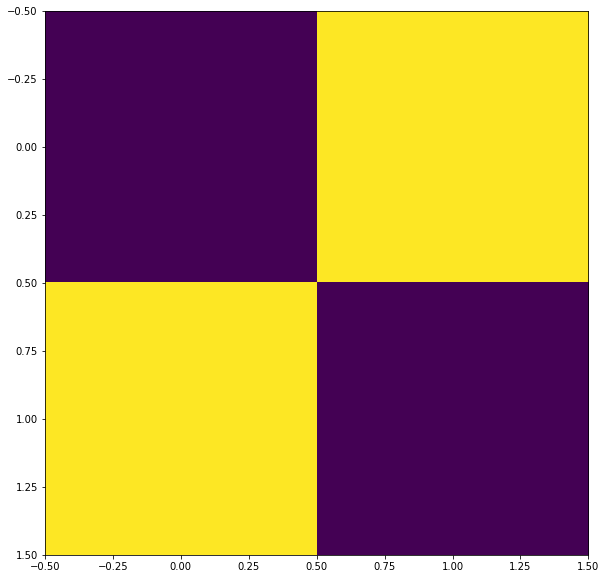
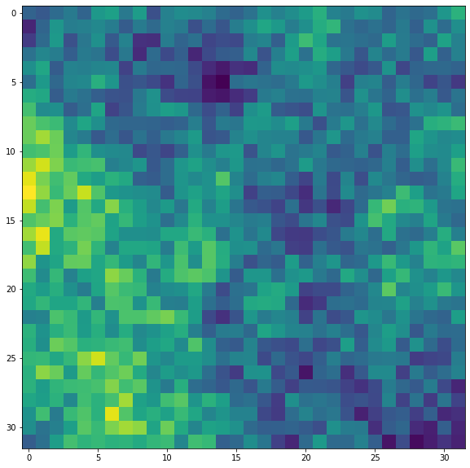

```python
# Imports
import numpy as np
import matplotlib.pyplot as plt
import math
import cv2
import time
```


```python
# Generation function

def generate ( map_size = 10, start_point = 0, extra_layers=[] ):
    
    size = 2**map_size
    
    # Choose what layers you want
    _ranges = list(range(start_point,map_size))
    _ranges.extend(extra_layers)
    
    # The output map
    a = np.zeros((size,size))
    
    # Compute layers
    for layer in _ranges:
        l = 2**layer
        rand = np.random.rand(l,l) /l
        a += cv2.resize( rand, (size,size) )   
        
    # Return
    return (a-a.min())/(a.max()-a.min())
```


```python
# Draw a halo effect arround layers above a cetain hight
def select (a, v, r):
    _r = np.logical_and(a > (v-r), a < (v+r))
    a[_r] = 0
    a[a < (v-r)] *= 0.8
    return a

```


```python
# Output
def show(a):
    plt.figure(figsize = (10,10))
    plt.imshow(a)
```


```python
# Simple gradient
show( generate( map_size=10 ) )
```


    

    


```python
# Gradient can be scaled witht the start_point
show( generate( map_size=10, start_point=2 ) )
```


    

    


```python
# Even further out
show( generate( map_size=10, start_point=4 ) )
```


    

    


```python
# Apply some borders
_ = generate( map_size=10, start_point=4 )
_ = select(_,0.4, 0.01)
show( _ )
```


    

    


```python
# By adding back in an earlier layer, we can aim for larger continents
for i in range(5):
    _ = generate( map_size=10, start_point=4, extra_layers=[2] )
    _ = select(_,0.4, 0.01)
    show( _ )
```


    

    


    

    


    

    


    

    


    

    


```python
# Thats all! enjoy
```
